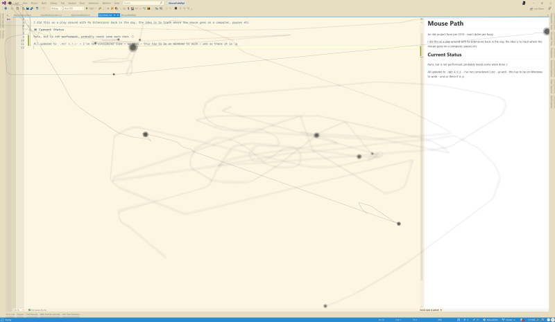

# Mouse Path

An old project from pre 2010 - exact dates are fuzzy

I did this as a play around with Rx Extensions back in the day, the idea is to track where the mouse goes on a computer, pauses etc

## Current Status

Runs, but is not performant, probably needs some work done :)

All updated to `.NET 4.7.2` - I've not considered Core - as well - this has to be on Windows to work - and so there it is :p

## Example

